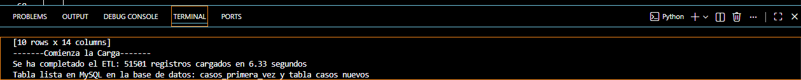
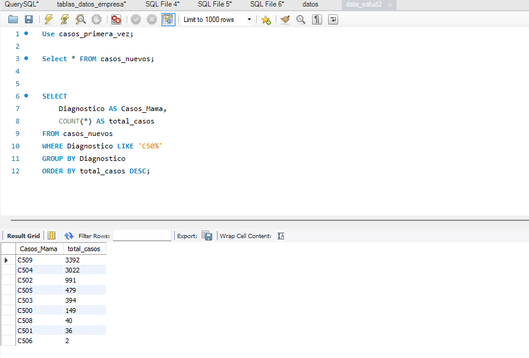

##🚀 Proyecto ETL de Casos Nuevos con Python, Pandas y MySQL

Este proyecto implementa un proceso ETL (Extract, Transform, Load) utilizando Python, Pandas, SQLAlchemy y MySQL para procesar información clínica desde archivos Excel.

##📌 Problema de negocio

La información clínica se encontraba almacenada en archivos Excel, lo que dificultaba:

la consulta eficiente de datos,
el control de calidad de la información,
la escalabilidad del almacenamiento,
la integración con otros sistemas,
y el análisis posterior de los registros.

Además, los archivos contenían:

formatos inconsistentes,
valores vacíos,
fechas inválidas,
y datos no normalizados.

##✅ Objetivos logrados
Lectura de archivos Excel desde una hoja específica (Base)
Selección de columnas relevantes para el análisis
Conversión automática de fechas usando pd.to_datetime()
Manejo de errores en fechas con errors="coerce"
Limpieza y transformación de datos
Reemplazo de valores vacíos y códigos especiales (99) por "No definido"
Conversión de valores NaN y NaT a NULL para MySQL
Conexión segura a MySQL usando variables de entorno (.env)
Inserción de datos mediante SQLAlchemy
Implementación de transacciones y rollback en caso de error
Uso de append para cargas incrementales
Medición del tiempo total del ETL

##🛠️ Tecnologías utilizadas
Python
Pandas
SQLAlchemy
PyMySQL
MySQL
python-dotenv

#🔒 Buenas prácticas implementadas
Uso de archivo .env para proteger credenciales
Exclusión de .env mediante .gitignore
Manejo de errores con try/except
Rollback automático usando transacciones
Validaciones previas antes de la carga

#📊 Resultado
Más de 51,000 registros procesados correctamente
Carga exitosa en MySQL en aproximadamente 6 segundos

Manejo optimizado de la información mediante queries en MySQL

